# Crypto Data Pipeline

This project is a production data engineering pipeline that collects crypto data every day and turns it into analytics-ready tables.

It combines Airflow, Databricks, and dbt to ingest data from multiple APIs, standardize it through a medallion model (bronze, silver, gold), and run quality checks before publishing outputs.

## Production Data Engineering, End to End

This project demonstrates practical data engineering skills that companies need:

- Building reliable daily ingestion pipelines.
- Combining orchestration, transformation, and testing in one system.
- Delivering business-facing datasets, not only raw data.
- Applying production practices like retries, idempotent loads, and quality gates.

<p align="center">
  
</p>


## Daily Orchestration Flow

<p align="center">
  
</p>

## Business-Oriented Outputs

Gold models support use cases such as:

- Daily market summary and rankings.
- BTC dominance analysis.
- Volatility monitoring.
- Sentiment vs price behavior.
- Liquidity-focused views for asset comparison.

## Tech Stack

<p align="center">
  
</p>

## Reliability and Quality

- Airflow retries with exponential backoff.
- Idempotent bronze load patterns to avoid duplicate corruption.
- dbt tests separated into critical and non-critical checks.
- Dedicated quality DAG to enforce data contracts regularly.

## Quick Start

From `airflow-docker`:

```bash
docker compose build
docker compose up airflow-init
docker compose up -d
```

## Repository Layout

- `airflow-docker/dags/`: ingestion, transformation, orchestration, and maintenance DAGs.
- `airflow-docker/dbt/`: dbt models, tests, macros, and profiles.

## Security Notes

- Store credentials in environment variables or Airflow connections.
- Do not commit real tokens or `.env` secrets.
